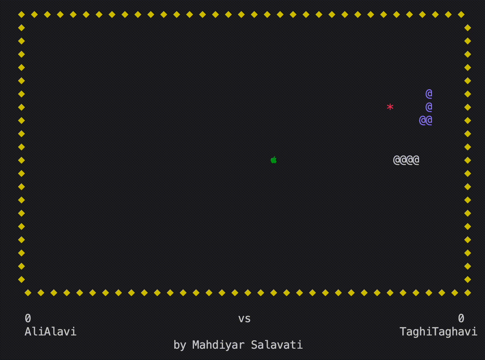

# Two-Player Snake Game

This is a dynamic, two-player Snake game implemented in C++. The game features exciting elements like apples for growth and bombs as obstacles. One player can control their snake using the WASD keys, while the other player can use the arrow keys.

## Features

- Two-player mode with separate control keys.
- Apples for growth and bombs as obstacles.
- Usernames and scores are stored using a linked list.

## Compatibility

The game is compatible with MacOS, Linux, and Windows.

## How to Run the Project

1. Ensure that the `snake.cpp` file and `clui.h` library are in the same directory.
2. Compile the `snake.cpp` file using a C++ compiler.
3. Run the compiled file.

Enjoy the game!
